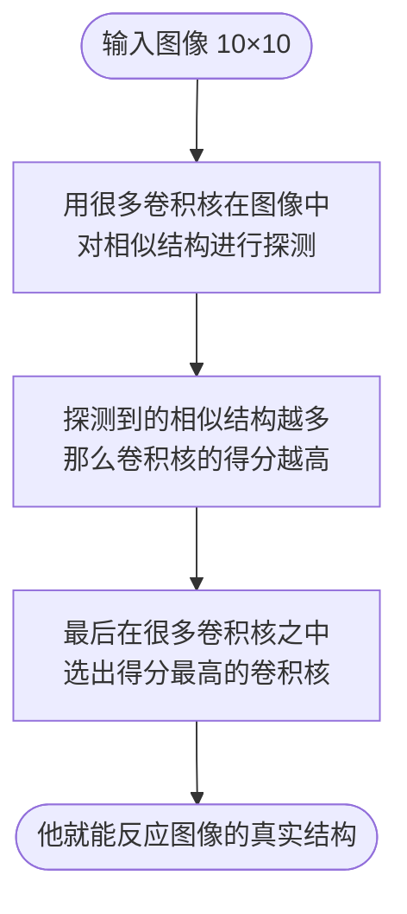

> 本篇所有代码均可运行, 推荐你亲手敲一遍:
> 源代码地址: **[Yueosa/lcnn](https://github.com/Yueosa/lcnn/tree/lminicnn)**

---

## 引言

这是一张只有 `10x10` 像素的 "图像", 我用 `■` 在里面画一条线

```text
   □ □ □ □ □ □ □ □ □ □
   □ □ □ □ □ □ □ □ □ □
   □ □ □ □ □ □ □ □ □ □
   □ □ □ □ □ □ □ □ □ □
   □ □ □ □ □ □ □ □ □ □
   □ □ ■ ■ ■ ■ ■ ■ □ □
   □ □ □ □ □ □ □ □ □ □
   □ □ □ □ □ □ □ □ □ □
   □ □ □ □ □ □ □ □ □ □
   □ □ □ □ □ □ □ □ □ □
```

对于计算机来说: 它其实只是一堆二进制码

我们将 `□` 看作是 `0`, `■` 看作是 `1`, 就得到了计算机的视角:

$$
A =
\begin{bmatrix}
0&0&0&0&0&0&0&0&0&0\\
0&0&0&0&0&0&0&0&0&0\\
0&0&0&0&0&0&0&0&0&0\\
0&0&0&0&0&0&0&0&0&0\\
0&0&0&0&0&0&0&0&0&0\\
0&0&1&1&1&1&1&1&0&0\\
0&0&0&0&0&0&0&0&0&0\\
0&0&0&0&0&0&0&0&0&0\\
0&0&0&0&0&0&0&0&0&0\\
0&0&0&0&0&0&0&0&0&0
\end{bmatrix}
$$

这个结构叫 **矩阵**: **一个按行和列整齐排列的数字表格**

当我们把他丢进一个极其简单的神经网络时, 网络输出了这样的结果:

```bash
  ┌─ 各核得分
  │  horizontal      3.00  ███ ◀ 预测
  │  vertical        1.00  █░░
  │  diag_left       1.00  █░░
  │  diag_right      1.00  █░░
  └─ 预测结果：horizontal
```

它 "认为":

> 这是一条 **horizontal** (横线)

---

这个结果非常神奇, 他引导我思考:

> **神经网络到底在 "看什么" ?**

他如何从一堆数字中, "感知" 出结构?

本篇不会使用任何深度学习框架, 我会带你:

- 手写一个最小的可运行 CNN 模型
- 用最基础的运算实现简单神经网络
- 进而一步步拆解 "识别" 的数学本质

---

## CNN

首先, **CNN到底是什么?**

回到引言的矩阵A, 仔细盯着它看一看：

$$
A =
\begin{bmatrix}
0&0&0&0&0&0&0&0&0&0\\
0&0&0&0&0&0&0&0&0&0\\
0&0&0&0&0&0&0&0&0&0\\
0&0&0&0&0&0&0&0&0&0\\
0&0&0&0&0&0&0&0&0&0\\
0&0&1&1&1&1&1&1&0&0\\
0&0&0&0&0&0&0&0&0&0\\
0&0&0&0&0&0&0&0&0&0\\
0&0&0&0&0&0&0&0&0&0\\
0&0&0&0&0&0&0&0&0&0
\end{bmatrix}
$$

横线在矩阵里有一个非常清晰的规律：**某一行全是 `1`，紧邻的行全是 `0`**

**这是一个可以用数字精确描述的结构**

既然图像本身可以写成矩阵，这个有规律的结构也可以

把 "横线的样子" 直接写成一个 3×3 的小矩阵：上行全为正、下行全为负，中间为零

$$
K = \begin{bmatrix} 1 & 1 & 1 \\ 0 & 0 & 0 \\ -1 & -1 & -1 \end{bmatrix}
$$

这个小矩阵就叫 **卷积核**（Kernel）——它是对某种结构规律的数字化编码

有了卷积核，接下来的想法很自然：拿着这个模板，在图像上比对，看哪里出现了这个结构, 哪里就有横线了, 这个操作叫 **卷积**

CNN（Convolutional Neural Network，卷积神经网络）做的正是这件事：

**不去理解整张图的含义，而是用一系列 卷积核 逐块扫描，看哪个核最匹配**

---

在我们这个最小版本里, 整个流程非常简单：



这些步骤在术语中被称作 **卷积, 激活, 池化**, 接下来我会逐步带你了解他们

---

#### 卷积

沿用上方的矩阵定义

现在我们有了图像矩阵 $A$ 和卷积核 $K$，来看看 **滑动比对** 具体是怎么运作的

从矩阵 $A$ 的某个位置取出一个 3×3 的窗口 $P$：

$$
P = \begin{bmatrix} 0&0&0\\ 1&1&1\\ 0&0&0 \end{bmatrix}
$$

将 $P$ 与 $K$ **逐元素相乘后求和**, 得到该位置的输出值：

$$
\text{output}[i,j] = \sum_{m=0}^{2}\sum_{n=0}^{2} A[i+m,\ j+n] \times K[m,n]
$$

展开计算就是

$$
\begin{bmatrix}
0&0&0\\
1&1&1\\
0&0&0
\end{bmatrix}
\cdot
\begin{bmatrix}
1&1&1\\
0&0&0\\
-1&-1&-1
\end{bmatrix}
=0
$$

用简单数学的方式写出来就是

$$
(0\cdot1+0\cdot1+0\cdot1)
+(1\cdot0+1\cdot0+1\cdot0)
+(0\cdot(-1)+0\cdot(-1)+0\cdot(-1))=0
$$

这个值可以代表 卷积核 $K$ 对该 `3x3` 区域的 **响应强度**, 强度越高, 说明卷积核在此处识别到的结构越相近

我们换一个位置, 再来计算一次, 此时窗口 $P'$ 为：

$$
P' = \begin{bmatrix} 1&1&1\\ 0&0&0\\ 0&0&0 \end{bmatrix}
$$

$$
\sum P' \times K = (1+1+1) + 0 + 0 = 3
$$

你会发现, 越像 "横线" 的边缘, 这个值就越大

这就是卷积在做的事情, **用一个小卷积核, 在整张图上寻找匹配的结构**

用这个 3×3 的卷积核在整张图上滑动扫描一次, 我们就能得到它的特征图（feature map）了

```text
    +0  +0  +0  +0  +0  +0  +0  +0
    +0  +0  +0  +0  +0  +0  +0  +0
    +0  +0  +0  +0  +0  +0  +0  +0
    -1  -2  -3  -3  -3  -3  -2  -1
    +0  +0  +0  +0  +0  +0  +0  +0
    +1  +2  +3  +3  +3  +3  +2  +1
    +0  +0  +0  +0  +0  +0  +0  +0
    +0  +0  +0  +0  +0  +0  +0  +0 
```

特征图（feature map）的大小是 8×8, 这是因为卷积核是 3×3 的, 必须完整地落在图像内部才能滑动：

$$
\text{输出大小} = (H - k + 1) \times (W - k + 1) = (10 - 3 + 1) \times (10 - 3 + 1) = 8 \times 8
$$

---

你可能会好奇, 为什么是 `-1 / 0 / 1`, 而不是只用 `0 / 1` 来标识一条直线

我们来看一个反例。假如把核设计成纯 `0 / 1`：

$$
K_{01} = \begin{bmatrix} 1&1&1\\ 0&0&0\\ 0&0&0 \end{bmatrix}
$$

现在取一块**全白区域**（没有任何线条）：

$$
P_{\text{white}} = \begin{bmatrix} 1&1&1\\ 1&1&1\\ 1&1&1 \end{bmatrix}
$$

$$
\sum P_{\text{white}} \times K_{01} = (1+1+1) + 0 + 0 = 3
$$

得分是 3 — 但这里根本没有线，这是**误报**

换成 `-1 / 0 / 1` 的核再算一次：

$$
\sum P_{\text{white}} \times K = (1+1+1) + 0 + (-1-1-1) = 0
$$

得分是 0，正确。这里 `-1` 的作用是**主动抵消背景亮度**，让核只响应**亮暗的对比变化**, 而不是整体亮度

因为我们检测的不是 "亮不亮", 而是图形的 **变化**

- 上面亮、下面暗 → 正值
- 上面暗、下面亮 → 负值
- 上下亮暗程度相同 → 零值

换句话说, **只要得出的不是零值, 就说明当前卷积核处于潜在结构的边缘**

---

#### ReLU

再看一眼上面那张特征图——注意第四行：

```
-1  -2  -3  -3  -3  -3  -2  -1
```

这行全是负数。为什么？卷积核扫到那里时，图像的结构和核**反向匹配**了：核期待上亮下暗，但那里是上暗下亮，结果得分为负

我们不关心反向响应，只关心正响应——某处得分为正，说明那里真的有匹配的结构。所以最直接的处理就是：**把负数全部清零，正数保持不变**

这个操作有一个名字叫 ReLU（Rectified Linear Unit）：

$$
\text{ReLU}(x) = \max(0,\ x)
$$

$$
\begin{bmatrix}
0&0&0&0&0&0&0&0\\
0&0&0&0&0&0&0&0\\
0&0&0&0&0&0&0&0\\
0&0&0&0&0&0&0&0\\
0&0&0&0&0&0&0&0\\
1&2&3&3&3&3&2&1\\
0&0&0&0&0&0&0&0\\
0&0&0&0&0&0&0&0
\end{bmatrix}
$$

---

那么我们为什么不使用 **绝对值** 去判断, 偏偏要杀掉负值呢? 来看一个具体的例子就知道了:

这是一个带有干扰的矩阵, 主体是 **横线**, 但是有一个散点作为干扰

$$
B =
\begin{bmatrix}
0&1&1&0\\
0&0&0&0\\
1&0&0&0\\
0&0&0&0
\end{bmatrix}
$$

接下来我们用 两个卷积核(横线核, 左斜线核) 对它进行 卷积:

$$
K_1 = 
\begin{bmatrix}
1&1&1\\
0&0&0\\
-1&-1&-1
\end{bmatrix}
\
K_2 =
\begin{bmatrix}
1&0&-1\\
0&1&0\\
-1&0&1
\end{bmatrix}
$$

得到的特征图分别是:

$$
F_1 = 
\begin{bmatrix}
1&2\\
0&0
\end{bmatrix}
\
F_2 =
\begin{bmatrix}
-2&1\\
0&0
\end{bmatrix}
$$

明明在 **卷积** 时, 引入 `-1` 是为了消除影响, 但是在多个卷积核同时进行计算的情况下, 他们远离 `0` 的程度是相同的

也就是说, `-1` 的引入为我们带来了 **反方向上的干扰**, 而 **ReLU** 正是为了对抗这种方向性

---

#### 池化

现在我们有了一张 8×8 的特征图，每个位置记录了卷积核在那里的匹配程度。但我们真正想回答的问题不是「哪里匹配最强」，而是「这张图里有没有横线」——只需要知道**最强的匹配有多强**就够了

所以最自然的压缩方式：取整张特征图的最大值——

$$
\text{score} = \max(\text{feature map}) = 3
$$

这就是该卷积核对图像的得分

---

如果我们继续沿用 **ReLU** 中举例的模型, 将 左斜线核 换成 右斜线核 , 那么他的最终得分都会是 **正数2**

然而 横线核 计算出的结果也是 **正数2**

这个结论说明: 卷积核越细化, 带来的干扰反而更大, 这是当前最小CNN模型的局限性

---

#### 预测

现在我们能对一张图计算出"它和横线核的匹配程度"了, 但只有一个核还不够——我们需要同时判断它是横线、竖线还是斜线

解法很自然：准备多个核, 每个核描述一种形状, 让它们分别对图像跑一次完整流程 (**卷积 → ReLU → 池化**), 各自得到一个得分：

$$
\text{scores} = \{\text{horizontal}: 3.00,\ \text{vertical}: 1.00,\ \text{diag\_left}: 1.00,\ \text{diag\_right}: 1.00\}
$$

然后取得分最高的那个：

$$
\hat{y} = \arg\max(\text{scores}) = \text{horizontal}
$$

---

## 手写一个最小 CNN

理论已经够了, 现在我们来亲手实现它

整个项目只有三个核心文件, 每一个文件对应一个职责：

```
lminicnn/
    filters.py   ← 定义卷积核（告诉网络要检测什么形状）
    conv.py      ← 实现卷积、ReLU、池化三个操作
    model.py     ← 把三个操作串成流水线
main.py   ← 用四种图形验证结果
```

> 除了 python 环境之外, 我们还需要用到一个第三方库 `numpy`, 这是一个非常强大的数学库, 被广泛用于矩阵数学计算
> 安装: `uv add numpy`

使用 `import numpy as np` 导入这个模块, `as` 是别名 (alias)的意思, 作用是可以把 `numpy.xxx()` 写法简化成 `np.xxx()`

我们从最简单的代码开始看

---

#### filters.py — 定义卷积核

这个文件定义了 4 个 `3x3` 的小矩阵, 叫作 "卷积核" (kernel), 每一个核就是一种 "模式过滤器"

```python
import numpy as np


def get_filters() -> dict[str, np.ndarray]:
    # 上正下负 → 检测水平边缘
    horizontal: np.ndarray = np.array([
        [ 1,  1,  1],
        [ 0,  0,  0],
        [-1, -1, -1]
    ])

    # 左正右负 → 检测垂直边缘
    vertical: np.ndarray = np.array([
        [1,  0, -1],
        [1,  0, -1],
        [1,  0, -1]
    ])

    # 对角线正、反对角负 → 检测左斜线（\\）
    diagonal_left: np.ndarray = np.array([
        [ 1,  0, -1],
        [ 0,  1,  0],
        [-1,  0,  1]
    ])

    # 反对角正、对角线负 → 检测右斜线（/）
    diagonal_right: np.ndarray = np.array([
        [-1,  0,  1],
        [ 0,  1,  0],
        [ 1,  0, -1]
    ])

    return {
        "horizontal":  horizontal,
        "vertical":    vertical,
        "diag_left":   diagonal_left,
        "diag_right":  diagonal_right,
    }
```

> numpy.array() 方法的作用是把一个 Python 列表转换成 numpy 的矩阵 (ndarray), 可以做矩阵运算

---

#### conv.py - 核心操作

这个文件定义三个核心操作: 卷积、ReLU、池化

```python
import numpy as np


def conv2d(input_matrix: np.ndarray, kernel: np.ndarray) -> np.ndarray:
    # shape 可以返回矩阵的 (行数, 列数)
    h, w = input_matrix.shape
    kh, kw = kernel.shape

    # 计算输出尺寸: 输出大小 = 输入大小 - 核大小 + 1
    output_h: int = h - kh + 1
    output_w: int = w - kw + 1

    # 创建一个全0的输出矩阵
    output: np.ndarray = np.zeros((output_h, output_w))

    # 双重循环, 让核在图像上逐位置滑动
    for i in range(output_h):
        for j in range(output_w):
            # 从图像上截取与核等大的小块
            region: np.ndarray = input_matrix[i:i+kh, j:j+kw]
            # 逐元素相乘后求和, 得到该位置的输出值
            output[i, j] = np.sum(region * kernel)

    return output


def relu(x: np.ndarray) -> np.ndarray:
    # 逐元素取 max(0, 值), 负数变0, 正数不变
    return np.maximum(0, x)


def global_max_pooling(feature_map: np.ndarray) -> np.float64:
    # 取整个特征图里响应最强的值作为该核的得分
    return np.max(feature_map)
```

> `np.zeros((h, w))` — 创建一个 h 行 w 列的全 0 矩阵, 用作输出的初始容器
> `np.sum(a)` — 对矩阵 a 中所有元素求和, 返回一个数
> `np.maximum(0, x)` — 逐元素比较 0 和 x 中的每个值, 取较大的那个, 相当于对整个矩阵批量执行 `max(0, 值)`
> `np.max(a)` — 返回矩阵 a 中所有元素里最大的那一个

`conv2d` 让核在图上逐位置滑动, 每个位置截取一块 `3x3` 区域做逐元素乘后求和, 核在 `10x10` 的图上共滑过 `8x8 = 64` 个位置, 所以特征图大小是 `8x8`

`relu` 将特征图中所有负数清零, 只保留有响应的位置

`global_max_pooling` 取特征图中的最大值作为该核的最终得分

#### model.py - CNN模型

这个文件需要将我们之前写的 `filters.py` 和 `conv.py` 组合起来, 变成真正的 CNN

```python
import numpy as np

from .conv import conv2d, relu, global_max_pooling
from .filters import get_filters


class SimpleCNN:
    def __init__(self):
        # 初始化所有卷积核
        self.filters: dict[str, np.ndarray] = get_filters()

    def forward(self, input_image: np.ndarray) -> dict[str, dict]:
        """
        对输入图像跑一次完整的前向传播

        对每个卷积核依次执行: 卷积 → ReLU → 全局最大池化

        :param input_image: 输入图像矩阵
        :return: 每个卷积核对应的结果字典, 包含 feature_map、activated、score
        """
        results = {}

        for name, kernel in self.filters.items():
            # 步骤1: 卷积 — 核在图像上滑动, 计算局部匹配度
            feature_map: np.ndarray = conv2d(input_image, kernel)
            # 步骤2: ReLU 激活 — 负数清零, 只保留正响应
            activated: np.ndarray = relu(feature_map)
            # 步骤3: 全局最大池化 — 压缩为单个得分
            score: float = global_max_pooling(activated)

            results[name] = {
                "feature_map": feature_map,
                "activated":   activated,
                "score":       score,
            }

        return results

    def predict(self, input_image: np.ndarray) -> tuple[str, dict[str, float], dict[str, dict]]:
        """
        对输入图像做分类预测

        :param input_image: 输入图像矩阵
        :return: (预测类别, 各核得分字典, 各核完整结果字典)
        """
        results: dict[str, dict] = self.forward(input_image)

        # 从每个核的结果中提取得分
        scores: dict[str, float] = {k: v["score"] for k, v in results.items()}
        # 取得分最高的核名作为预测结果
        prediction: str = max(scores, key=scores.get)

        return prediction, scores, results
```

`forward` 是前向传播: 对每个卷积核依次执行三步流水线, 把结果收集到字典里返回

`predict` 在 `forward` 的基础上提取每个核的得分, 取最高分对应的核名作为预测类别

---

#### main.py — 验证结果

`main.py` 分为两个部分: 四个 `make_*` 函数负责生成测试图像, 其余函数负责格式化输出

```python
import numpy as np

from lminicnn.model import SimpleCNN


# ── 测试图像生成 ──────────────────────────────────────────
# 以下四个函数各自生成一张 10×10 的图像, 用于测试模型的识别能力

def make_horizontal() -> np.ndarray:
    """第5行中间画一条水平线"""
    img = np.zeros((10, 10))
    img[5, 2:8] = 1
    return img

def make_vertical() -> np.ndarray:
    """第5列中间画一条垂直线"""
    img = np.zeros((10, 10))
    img[2:8, 5] = 1
    return img

def make_diag_left() -> np.ndarray:
    """左斜线 (\\) ：从左上到右下"""
    img = np.zeros((10, 10))
    for k in range(6):
        img[2 + k, 2 + k] = 1
    return img

def make_diag_right() -> np.ndarray:
    """右斜线 / ：从右上到左下"""
    img = np.zeros((10, 10))
    for k in range(6):
        img[2 + k, 7 - k] = 1
    return img


# ── 输出格式化 ────────────────────────────────────────────
# 以下函数负责将预测结果以可读的方式打印到终端

def print_image(img: np.ndarray) -> None:
    for row in img:
        print("  " + "".join([" ■" if x > 0 else " □" for x in row]))


def run_one(name: str, img: np.ndarray, model: SimpleCNN) -> None:
    print("\n" + "═" * 52)
    print(f"  测试图形：{name}")
    print("═" * 52)
    print("  输入图像 (10×10)：")
    print_image(img)

    pred, scores, _ = model.predict(img)

    print("\n  ┌─ 各核得分")
    max_score = max(scores.values())
    for k, v in scores.items():
        bar    = "█" * int(v) + "░" * max(0, int(max_score) - int(v))
        marker = " ◀ 预测" if k == pred else ""
        print(f"  │  {k:<14} {v:>5.2f}  {bar}{marker}")
    print(f"  └─ 预测结果：{pred}")


def main() -> None:
    model: SimpleCNN = SimpleCNN()

    shapes = [
        ("水平线  —", make_horizontal()),
        ("垂直线  |", make_vertical()),
        ("左斜线  \\", make_diag_left()),
        ("右斜线  /", make_diag_right()),
    ]

    for name, img in shapes:
        run_one(name, img, model)


if __name__ == "__main__":
    main()
```

`make_*` 函数用 `np.zeros` 创建全黑图像, 再把对应位置设为 `1` 画出线条, 四个函数分别对应横线、竖线、左斜、右斜

`print_image` 把数字矩阵还原成 `■ / □` 的视觉形式, `run_one` 调用模型并把得分渲染成进度条形式打印出来

---

#### 运行代码

四个文件都写好之后, 在项目根目录执行:

```bash
uv run main.py
```

你会看到四组测试的输出, 每组包含输入图像的可视化和各核的得分

```bash
════════════════════════════════════════════════════
  测试图形：水平线  —
════════════════════════════════════════════════════
  输入图像 (10×10)：
   □ □ □ □ □ □ □ □ □ □
   □ □ □ □ □ □ □ □ □ □
   □ □ □ □ □ □ □ □ □ □
   □ □ □ □ □ □ □ □ □ □
   □ □ □ □ □ □ □ □ □ □
   □ □ ■ ■ ■ ■ ■ ■ □ □
   □ □ □ □ □ □ □ □ □ □
   □ □ □ □ □ □ □ □ □ □
   □ □ □ □ □ □ □ □ □ □
   □ □ □ □ □ □ □ □ □ □

  ┌─ 各核得分
  │  horizontal      3.00  ███ ◀ 预测
  │  vertical        1.00  █░░
  │  diag_left       1.00  █░░
  │  diag_right      1.00  █░░
  └─ 预测结果：horizontal

════════════════════════════════════════════════════
  测试图形：垂直线  |
════════════════════════════════════════════════════
  输入图像 (10×10)：
   □ □ □ □ □ □ □ □ □ □
   □ □ □ □ □ □ □ □ □ □
   □ □ □ □ □ ■ □ □ □ □
   □ □ □ □ □ ■ □ □ □ □
   □ □ □ □ □ ■ □ □ □ □
   □ □ □ □ □ ■ □ □ □ □
   □ □ □ □ □ ■ □ □ □ □
   □ □ □ □ □ ■ □ □ □ □
   □ □ □ □ □ □ □ □ □ □
   □ □ □ □ □ □ □ □ □ □

  ┌─ 各核得分
  │  horizontal      1.00  █░░
  │  vertical        3.00  ███ ◀ 预测
  │  diag_left       1.00  █░░
  │  diag_right      1.00  █░░
  └─ 预测结果：vertical

════════════════════════════════════════════════════
  测试图形：左斜线  \
════════════════════════════════════════════════════
  输入图像 (10×10)：
   □ □ □ □ □ □ □ □ □ □
   □ □ □ □ □ □ □ □ □ □
   □ □ ■ □ □ □ □ □ □ □
   □ □ □ ■ □ □ □ □ □ □
   □ □ □ □ ■ □ □ □ □ □
   □ □ □ □ □ ■ □ □ □ □
   □ □ □ □ □ □ ■ □ □ □
   □ □ □ □ □ □ □ ■ □ □
   □ □ □ □ □ □ □ □ □ □
   □ □ □ □ □ □ □ □ □ □

  ┌─ 各核得分
  │  horizontal      1.00  █░░
  │  vertical        1.00  █░░
  │  diag_left       3.00  ███ ◀ 预测
  │  diag_right      1.00  █░░
  └─ 预测结果：diag_left

════════════════════════════════════════════════════
  测试图形：右斜线  /
════════════════════════════════════════════════════
  输入图像 (10×10)：
   □ □ □ □ □ □ □ □ □ □
   □ □ □ □ □ □ □ □ □ □
   □ □ □ □ □ □ □ ■ □ □
   □ □ □ □ □ □ ■ □ □ □
   □ □ □ □ □ ■ □ □ □ □
   □ □ □ □ ■ □ □ □ □ □
   □ □ □ ■ □ □ □ □ □ □
   □ □ ■ □ □ □ □ □ □ □
   □ □ □ □ □ □ □ □ □ □
   □ □ □ □ □ □ □ □ □ □

  ┌─ 各核得分
  │  horizontal      1.00  █░░
  │  vertical        1.00  █░░
  │  diag_left       1.00  █░░
  │  diag_right      3.00  ███ ◀ 预测
  └─ 预测结果：diag_right 
```

四张图全部识别正确, 而且每次都是匹配的那个核得 `3.00`, 其余三个核得 `1.00`

`3.00` 来自于池化步骤取到的最大值 — 横线核扫过水平线时, 正好有三列连续像素与核完全匹配, 得分达到最高; 其他核因为结构不匹配, 得分始终压不过它

`1.00` 不是 `0`, 是因为任意图形都会和每个核在某些位置产生微弱的局部响应, 不匹配并不意味着完全没有交集

---

不过到这里, 有一个问题值得注意:

> 我们这个 CNN 的卷积核是**手写的** — 横线核、竖线核、斜线核, 全部由我们自己定义好了

真实的神经网络不会这样做

它不需要人告诉它"横线长什么样" — 它通过大量数据和反向传播, 自己从头学会应该用什么样的核去检测特征

这就是下一章要讲的内容: **卷积核是如何被学习出来的**

---
