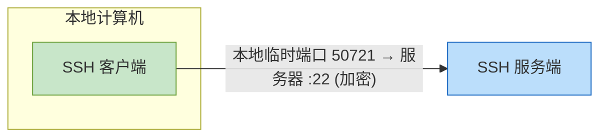
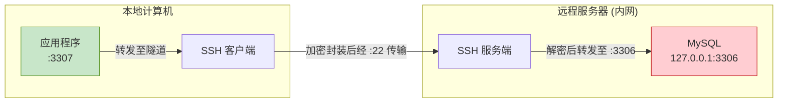
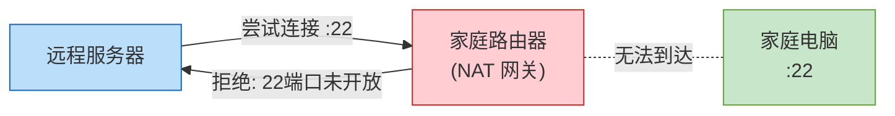
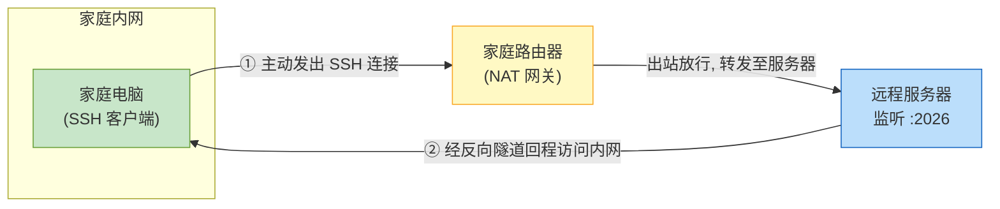
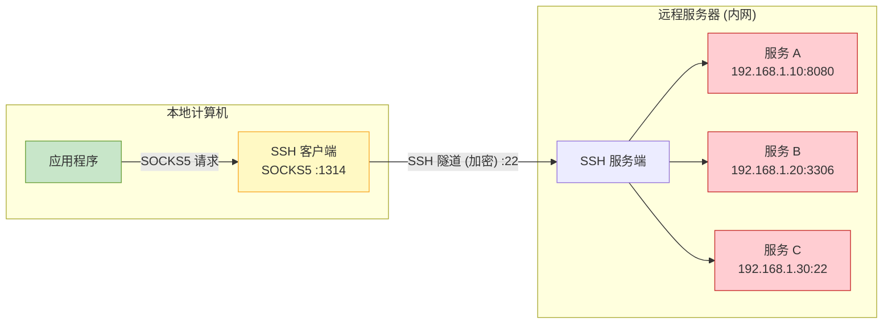

## 引言

我们通常使用 `ssh` 命令来连接远程的服务器, 例如:

```bash
ssh 用户名@服务器
```

当登录完成后（成功建立 **SSH 会话**）, 我们将会拿到目标服务器的 `shell`, 这时候我们就能利用它来执行一些命令

例如发送 `ls`, 客户端将会加密进行传输, 执行的结果同样会以加密形式返回, 两边的 **防火墙** 完全不知道数据包内部是什么

**加密传输** 是 `ssh` 一大重要的特性, 但他的前提是能够建立 `ssh` 会话(服务处于公网并且暴露了端口)

## 开发中遇到的问题

开发一个全栈应用并不是在本地写好, 然后到生产环境部署就好了, 有时候需要对单个服务进行快速测试——例如单独测试后端 API, Bug 探测/复现, 以及冒烟测试时做性能评估, 都需要模拟或使用真实的生产环境

有一天我需要对生产数据库进行测试, 但由于安全策略配置, 我的数据库仅允许内网访问, 问题就出现了

直接开启数据库的远程连接访问是危险的, 不论配置开销, 你能通过 **公网** 连接他, 别人当然也扫得到

能不能开启一个安全的入口, 将我们访问数据库的请求从内网转发过去呢? 这就是我开始学习 `ssh 隧道` 的原因

## 服务连接原理

`ssh 服务端` 默认监听 **22** 端口, 当我们的客户端进行连接时, 双方连接情况是这样的:



此时我们只拿到了服务器的 `shell`, 无法访问内网中的其他服务

如果服务端仅仅开放了 `22` 端口, 内网数据库也仅仅开放 `3306` 端口, 我们是没办法访问任何其他进程的

这么看来, 我们想从本地访问到远程内网的数据库是很困难的, 但也不是毫无办法

## 建立本地隧道

**如果能将 `SSH 服务端` 作为 `跳板机`, 让他帮我们转发数据包, 理论上就能访问到远程内网数据库了**



1. SSH 客户端监听本地的 `3307` 端口, 当有程序尝试连接时, 请求会被拦截并加密封装
2. 加密数据经由 SSH 隧道发送到服务端, 服务端解密后识别出目标是内网的 `3306` 端口
3. 服务端将请求转发给内网数据库, 数据库的响应同样原路加密返回

这样我们就得到了一条隧道, 由本地的 `3307` 端口发起, 连接到远端内网的 `3306` 端口, 全程由 SSH 加密保护

### 进行一次实操

建立一个本地 `SSH 隧道` 的语法如下:

```bash
ssh -i 本地私钥路径 \
    -L 本地监听地址:本地监听端口:远端目标地址:远端目标端口 \
    用户@服务器地址
# 本地监听地址/端口: 在本机开放的入口
# 远端目标地址/端口: 从 SSH 服务端视角看的转发目标
```

例如上面的例子写出来就是这样的:

```bash
ssh -i ~/.ssh/ssh_r3321.pem \
    -L 127.0.0.1:3307:127.0.0.1:3306 \
    ubuntu@vps
```

> `-L` 的目标地址（第二个地址）是 **从 SSH 服务端的视角** 解析的, 因此不限于 SSH 服务器本机
>
> 例如将 `127.0.0.1:3306` 换成 `192.168.1.100:3306`, 就可以转发到远程内网中另一台机器的数据库

> - 如果需要转发 IPv6 地址, 可以不填本地监听地址, 只指定端口, 例如 `-L 3307:127.0.0.1:3306`
> - 如果不希望拿到服务器的 `shell`, 可以使用 `-N` 参数
> - 如果需要后台运行隧道, 可以使用 `-f` 参数

如果你在连接的时候发现服务器并没有做端口转发, 那恭喜你又可以在折腾的过程中学到一点东西(bushi)

> **注意**: 需要在服务端的 `/etc/ssh/sshd_config` 中将 `AllowTcpForwarding` 设置为 `yes`, 否则服务端不会发起后续的 TCP 连接。不过云厂商的服务器一般默认已开启。

## 反向隧道(内网穿透)

如果我需要让远程服务器操作我本地内网的机器应该怎么办呢?

一般来说家庭局域网的结构是路由器作为三层网关, 很多路由器是自动屏蔽 `22` 端口的, 意味着我们无法在远程服务器上直接 `ssh` 家里的电脑



这时候就需要基于我们向服务器发起的连接, 反向打通一个 **隧道**, 使服务器的请求绕过 **网关**, 直接进入我们的内网, 之后再由我们内网进行处理



这就是 **反向隧道**, 也叫 **内网穿透**, 具体的实操命令如下:

```bash
ssh -i ~/.ssh/ssh_r3321.pem \
    -R 服务器监听端口:内网目标地址:内网目标端口 \
    用户@服务器地址
# 服务器监听端口: 在远程服务器上开放的入口端口
# 内网目标地址/端口: 从本机视角看的转发目标 (可以是自己或内网其他机器)
```

例如让服务器通过 `2026` 端口访问本机的 SSH:

```bash
ssh -i ~/.ssh/ssh_r3321.pem \
    -R 2026:localhost:22 \
    用户@服务器地址
```

> 内网目标地址可以是 `localhost`(本机), 也可以是内网中任意可达的机器地址

成功建立连接后, 我们可以到远程服务器上尝试连接了

```bash
ssh -p 2026 用户@主机名
```

> **提示**: 默认情况下这条隧道只允许服务器本机访问内网。如果想让公网上的其他电脑也能通过服务器访问内网, 可以在服务器的 `/etc/ssh/sshd_config` 中开启 `GatewayPorts`

## 动态隧道

如果有时候我要同时访问多个服务器内网的服务端口, 总不能敲一大堆隧道吧? 而且如果远程内网中的机器通过 `DHCP` 获取了不同的地址, 我的隧道也要重新建立了

有没有一种方式更便捷的访问他们呢? `ssh` 提供了 **动态隧道** 功能, 基于 `socks5` 协议, 命令如下:

```bash
ssh -i ~/.ssh/ssh_r3321.pem \
    -D 1314 \
    用户@服务器地址
```

这个连接会将 `1314` 端口变为 `socks5` 代理服务器, 任何支持 `socks5` 代理的软件, 都可以通过这个端口访问远程内网中的任意主机以及端口



假设远程内网中有一台机器在 `127.0.0.1:8080` 运行着一个 HTTP 服务, 此时我们就可以在命令行中进行测试了:

```bash
curl --socks5-hostname localhost:1314 http://127.0.0.1:8080/
```

这样 `curl` 就会将请求发给 `socks5` 代理服务器, 由代理服务器通过 SSH 隧道转发到远程内网, 最终到达 `8080` 端口的服务

无论内网中有多少台机器、端口如何变化, 只要目标对 SSH 服务器可达, 都可以通过这条动态隧道访问
