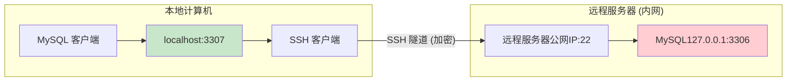

## 1️⃣ 标题测试

```md
# 一级标题

## 二级标题

### 三级标题

#### 四级标题

##### 五级标题

###### 六级标题
```

# 一级标题

## 二级标题

### 三级标题

#### 四级标题

##### 五级标题

###### 六级标题

---

## 2️⃣ 文本效果测试

```md
**文本加粗**

*文本斜体*

***加粗斜体***

~~删除线~~

`行内代码`

HTML 下划线
```

**文本加粗**

*文本斜体*

***加粗斜体***

~~删除线~~

`行内代码`

HTML 下划线

---

## 3️⃣ 列表测试

```md
* 无序列表一
* 无序列表二
  * 子列表一
  * 子列表二
* 无序列表三

1. 有序列表1
2. 有序列表2
3. 有序列表3
```

* 无序列表一
* 无序列表二
  * 子列表一
  * 子列表二
* 无序列表三

1. 有序列表1
2. 有序列表2
3. 有序列表3

---

## 4️⃣ 引用测试

```md
> 连续引用第一行
> 连续引用第二行

> 引用块
>
> 这是第二行引用

> 嵌套引用第一层
>> 嵌套引用第二层
>>> 嵌套引用第三层

```

> 连续引用第一行
> 连续引用第二行

> 引用块
>
> 这是第二行引用

> 嵌套引用第一层
>
>> 嵌套引用第二层
>>
>>> 嵌套引用第三层
>>>
>>

---

## 5️⃣ 代码块测试

````md
```md
这是一个 `console.log("lian love")` 示例
```
````

```md
这是一个 `console.log("lian love")` 示例
```

````md
```
function lian() {
    return "lian love";
}
```
````

```
function lian() {
    return "lian love";
}
```

````md
```rust
fn main() {
    println!("lian love");
}
```
````

```rust
fn main() {
    println!("lian love");
}
```

````md
```yaml
boolean: 
    - TRUE
    - FALSE
float:
    - 3.14
    - 6.8523015e+5
int:
    - 123
    - 0b1010_0111_0100_1010_1110
null:
    nodeName: 'node'
    parent: ~
string:
    - 哈哈
    - 'Lian Love'
    - newline
      newline2
date:
    - 2018-02-17
datetime: 
    -  2018-02-17T15:02:31+08:00
```
````

```yaml
boolean: 
    - TRUE
    - FALSE
float:
    - 3.14
    - 6.8523015e+5
int:
    - 123
    - 0b1010_0111_0100_1010_1110
null:
    nodeName: 'node'
    parent: ~
string:
    - 哈哈
    - 'Lian Love'
    - newline
      newline2
date:
    - 2018-02-17
datetime: 
    -  2018-02-17T15:02:31+08:00
```

````md

````


---

## 6️⃣ 链接/图片测试

```md
[链接 YukiKoi](https://yeastar.xin)
```

[链接 YukiKoi](https://yeastar.xin)

```md

```


---

## 7️⃣ 表格测试

```md
| 表格 | 类型 | 说明 |
|-|-|-|
| `恋` | **人类** | 博主 |
| `Arch` | **系统** | 折腾 |
```


| 表格   | 类型     | 说明 |
| ------ | -------- | ---- |
| `恋`   | **人类** | 博主 |
| `Arch` | **系统** | 折腾 |

---

## 8️⃣ 任务清单测试

```md
- [x] 任务列表
- [ ] 未完成

```

- [X]  任务列表
- [ ]  未完成

---

## 9️⃣ 脚注测试

```md
这是一个脚注[^1]

[^1]: 这是脚注内容
```

这是一个脚注[^1]

---

## 1️⃣0️⃣ 数学公式测试

```md
行内公式: $E = mc^2$

块级公式:

$$
\int_0^1 x^2 dx
$$
```

行内公式: $E = mc^2$

块级公式:

$$
\int_0^1 x^2 dx
$$

---

## 1️⃣1️⃣ HTML 测试

```md

    这是一个HTML容器

```


    这是一个HTML容器


```md


这是元素 **居中测试**, 标签为 ``


```


这是元素 **居中测试**, 标签为 ``


---

## 1️⃣2️⃣ 正文测试

## ✨ 设计理念

这个博客不是企业官网，也不是炫技舞台。

它更像一本安静的笔记本。

我在这里记录：

- 技术
- 思考
- 情绪
- 抱怨
- 生活碎片
- 以及那些突然想明白的瞬间

它不追求锋利，不制造压迫感。
它希望给人一种：

**舒缓、柔软、真实的存在感。**

---

## 🎨 视觉语言

### 核心色调[^2]

```css
--lian-blue:  #7EB6D9;
--lian-pink:  #E8A4B4;
--lian-white: #FAFAFA;
--lian-bg:    #F6F7F9;
```

* 蓝色代表逻辑与秩序
* 粉色代表感受与表达
* 白色代表留白与呼吸

整体配色偏低饱和，像彩铅画在纸上。

[^2]: 作者本人 **不是MTF**, 选择这些颜色是因为好看, 仅此而已
    
[^1]: 这是脚注内容
